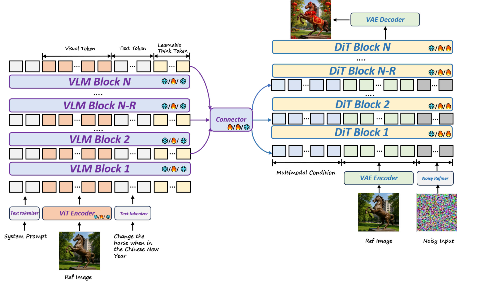
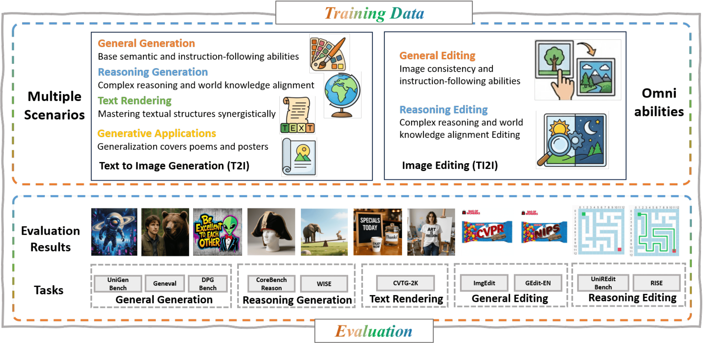
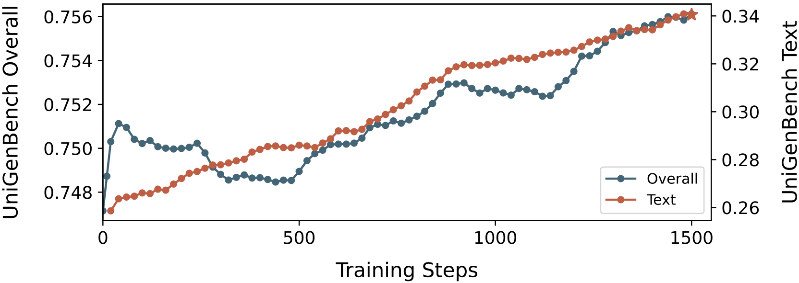
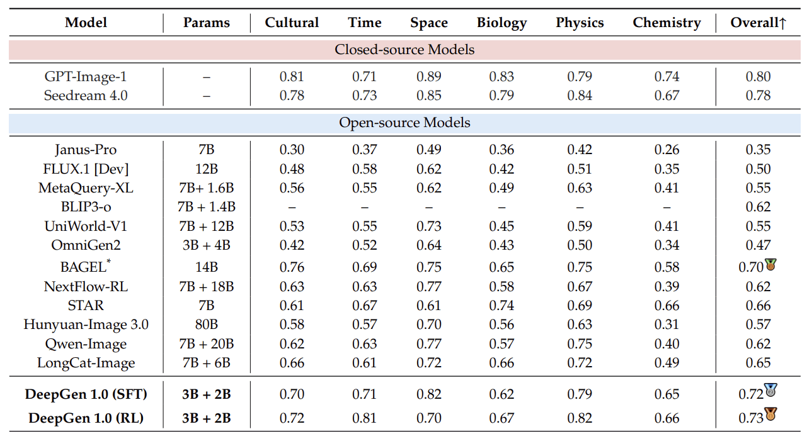
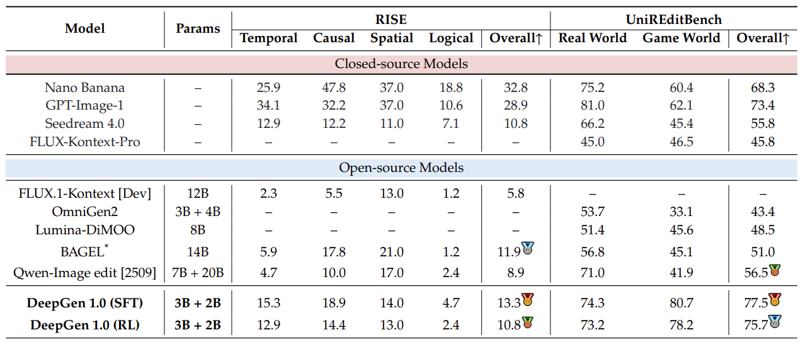

# DeepGen-RL

**A Lightweight Unified Multimodal Model for Image Generation and Editing**

[[Paper]](https://arxiv.org/abs/2602.12205) | [[Code]](https://github.com/deepgenteam/deepgen) | [[RL Code]](https://github.com/deepgenteam/deepgen-rl) | [[Model]](https://huggingface.co/deepgenteam/DeepGen-1.0)


## Highlights

- **5B parameters** (3B VLM + 2B DiT) — a single model for image generation, image editing, reasoning generation, reasoning editing, and text rendering.
- Competitive with models 3–16x larger on multiple benchmarks.
- Strong reasoning: WISE 0.73 (28% above HunyuanImage 3.0 80B); UniREditBench 77.5 (37% above Qwen-Image-Edit 27B).
- Data-efficient: ~50M training samples vs. 1.2B–5B for comparable models.

## Abstract

Current unified multimodal models for image generation and editing typically rely on massive parameter scales (e.g., >10B), entailing prohibitive training costs and deployment footprints. In this work, we present DeepGen 1.0, a lightweight 5B unified model that achieves comprehensive capabilities competitive with or surpassing much larger counterparts. To overcome the limitations of compact models in semantic understanding and fine-grained control, we introduce **Stacked Channel Bridging (SCB)**, a deep alignment framework that extracts hierarchical features from multiple VLM layers and fuses them with learnable "think tokens" to provide the generative backbone with structured, reasoning-rich guidance. We further design a data-centric training strategy spanning three progressive stages: (1) **Alignment Pre-training** on large-scale image-text pairs and editing triplets to synchronize VLM and DiT representations, (2) **Joint Supervised Fine-tuning** on a high-quality mixture of generation, editing, and reasoning tasks to foster omni-capabilities, and (3) **Reinforcement Learning with MR-GRPO**, which leverages a mixture of reward functions and supervision signals, resulting in substantial gains in generation quality and alignment with human preferences, while maintaining stable training progress and avoiding visual artifacts. Despite being trained on only ~50M samples, DeepGen 1.0 achieves leading performance across diverse benchmarks, surpassing the 80B HunyuanImage by 28% on WISE and the 27B Qwen-Image-Edit by 37% on UniREditBench. By open-sourcing our training code, weights, and datasets, we provide an efficient, high-performance alternative to democratize unified multimodal research.

## News

- [2026-02-13] Release the initial version of DeepGen-RL code and report.

## Quick Start

```bash
# 1. Create conda environment
conda env create -f environment.yml
conda activate deepgen_rl

# 2. Install additional dependencies
pip install -U openmim && mim install mmengine
pip install xtuner
pip install triton==3.1.0
pip install bitsandbytes==0.48.1
pip install transformers==4.51.3

# 3. Install CLIP and diffusers
pip install git+https://github.com/openai/CLIP.git
pip install git+https://github.com/huggingface/diffusers.git

# 4. Install Flash Attention
pip install flash-attn==2.7.2.post1 --no-build-isolation

# 5. Start reward services, then run training
bash scripts/train.sh
```

See [Installation Guide](docs/installation.md) for detailed setup instructions and [Training Guide](docs/training.md) for configuration options.

## Documentation

| Document | Description |
|----------|-------------|
| [Installation](docs/installation.md) | Environment setup and dependency installation |
| [Training](docs/training.md) | Training configuration, reward services, and parameter reference |
| [Installation (CN)](docs/cn/installation.md) | Installation guide in Chinese |
| [Training (CN)](docs/cn/training.md) | Training guide in Chinese |

<details>
<summary><b>Architecture</b></summary>

DeepGen 1.0 follows a VLM-DiT dual-tower design. A 3B VLM handles multimodal understanding and reasoning, while a 2B DiT decoder generates images. The two are connected via **Stacked Channel Bridging (SCB)** — a lightweight connector that fuses features sampled from multiple VLM layers (low, mid, high) through channel concatenation and a Transformer encoder, preserving both fine-grained visual details and high-level semantics. Additionally, **128 learnable Think Tokens** are appended to the text sequence, acting as an implicit chain-of-thought that helps the model reason before generating.



</details>

<details>
<summary><b>Training Pipeline</b></summary>

DeepGen 1.0 uses a three-stage progressive training pipeline:

1. **Alignment Pre-training** — Only the SCB connector and Think Tokens are trained; all other parameters are frozen.
2. **Joint SFT** — The DiT is unfrozen and trained end-to-end with LoRA on the VLM, using a multi-task mixture covering generation, editing, reasoning, and text rendering.
3. **MR-GRPO Reinforcement Learning** — Multi-Reward Group Relative Policy Optimization with mixed pointwise/pairwise rewards (VLM preference, OCR accuracy, CLIP similarity) and an auxiliary SFT loss to prevent capability degradation. Stably scales to 1,500 steps without reward hacking.





</details>

<details open>
<summary><b>Results: General Generation & Editing</b></summary>


</details>

<details open>
<summary><b>Results: Reasoning Generation</b></summary>



</details>

<details open>
<summary><b>Results: Reasoning Editing</b></summary>



</details>

## ⭐ Citation
```bibtex
@article{wang2026deepgen,
  title={DeepGen 1.0: A Lightweight Unified Multimodal Model for Advancing Image Generation and Editing},
  author={Wang, Dianyi and Li, Ruihang and Han, Feng and Ma, Chaofan and Song, Wei and Wang, Siyuan and Wang, Yibin and Xin, Yi and Liu, Hongjian and Zhang, Zhixiong and others},
  journal={arXiv preprint arXiv:2602.12205},
  year={2026}
}
```

## License

This project is licensed under the Apache-2.0 License. See the [LICENSE](LICENSE) file for details.
